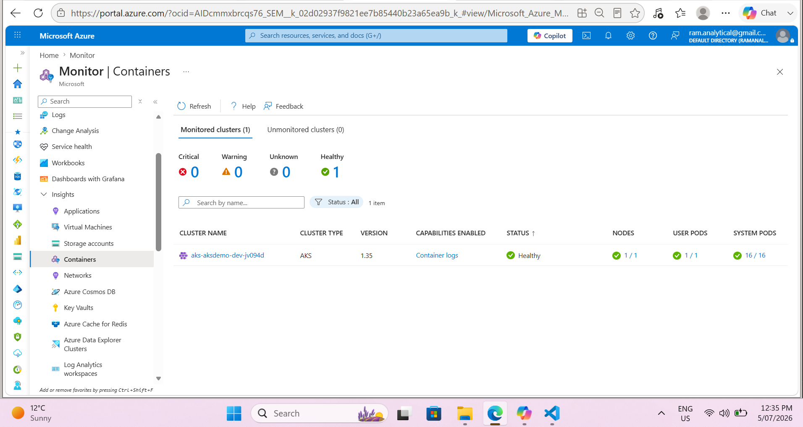
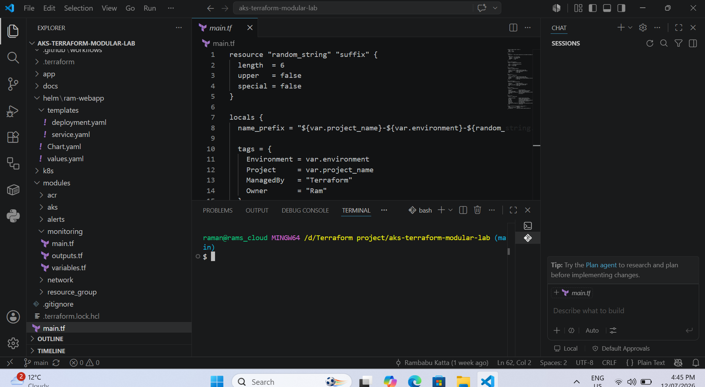
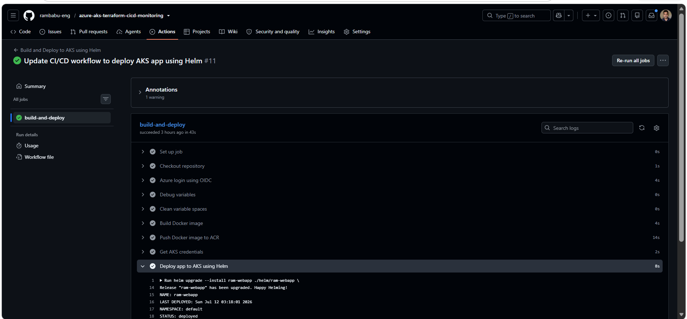
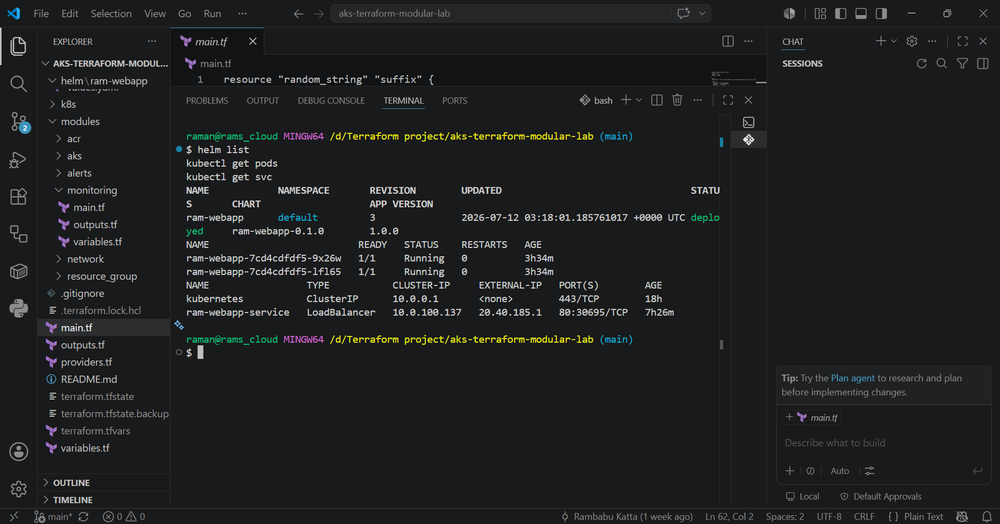
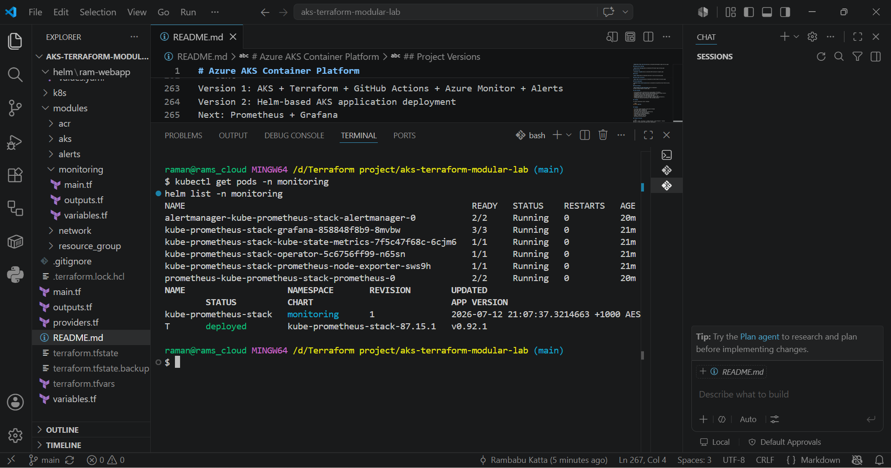
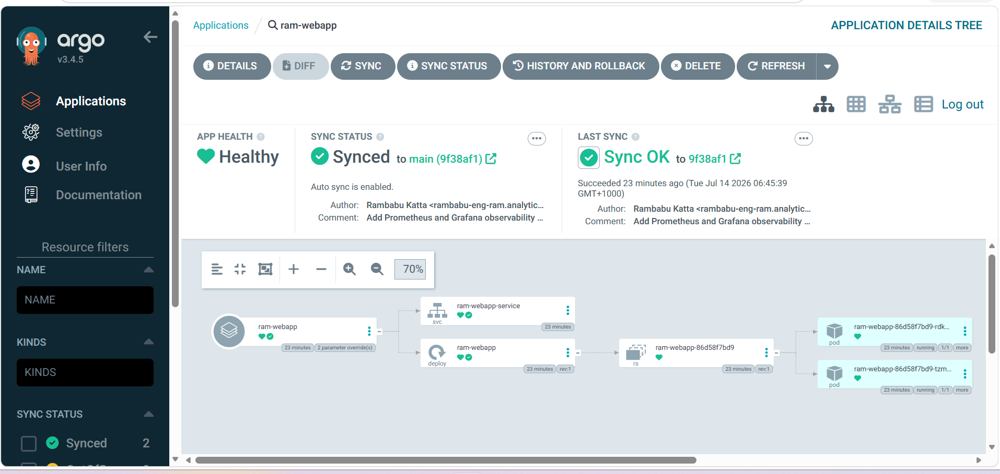
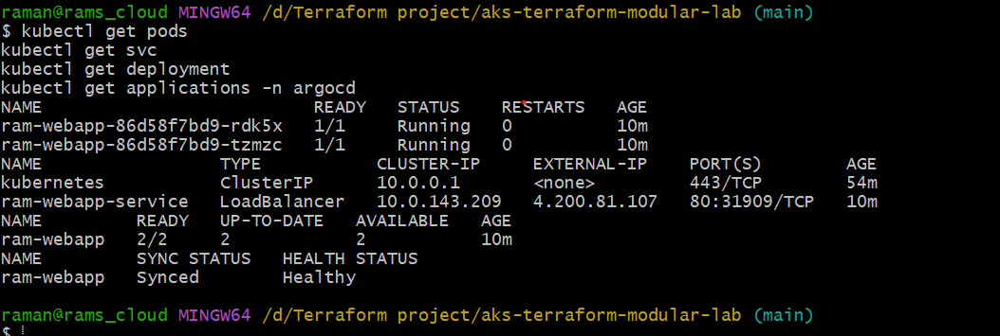

# Azure AKS Container Platform

A modular Azure Kubernetes Service platform built with Terraform, Docker, Azure Container Registry, GitHub Actions, Helm, Argo CD, Kubernetes, Azure Monitor, Prometheus, and Grafana.

The project demonstrates Infrastructure as Code, secure CI/CD authentication, container image delivery, Helm-based application deployment, GitOps-based delivery with Argo CD, AKS monitoring, Kubernetes-native observability, and operational alerting.

## Architecture


```text
Developer
→ GitHub Repository
→ GitHub Actions
→ Docker Build
→ Azure Container Registry
→ Argo CD
→ Helm Chart
→ AKS
→ Kubernetes Service LoadBalancer
→ Application
```

Monitoring flow:

```text
AKS
→ Container Insights
→ Log Analytics Workspace
→ Azure Monitor Alerts
→ Action Group
```

Kubernetes-native observability flow:

```text
AKS
→ Prometheus
→ Grafana
→ Kubernetes Dashboards
```

GitOps flow:

```text
GitHub Repository
→ Argo CD watches Helm chart
→ Syncs desired state
→ Deploys to AKS
→ Self-heals drift
```

## Key Features

- Modular Terraform infrastructure
- Secure GitHub Actions authentication using OIDC
- Docker image build and push to Azure Container Registry
- Helm-based AKS application deployment
- Argo CD GitOps deployment from GitHub to AKS
- Clear separation between CI and GitOps deployment responsibilities
- Azure Monitor, Container Insights, and Log Analytics
- Azure Monitor alert rules and Action Group notifications
- Prometheus and Grafana deployed using Helm
- Kubernetes rollout validation and dashboard-based observability

## Technology Stack

| Area | Technology |
|---|---|
| Cloud | Microsoft Azure |
| Infrastructure as Code | Terraform |
| Container Platform | AKS |
| Container Registry | ACR |
| Containerisation | Docker |
| CI/CD | GitHub Actions |
| Authentication | OIDC |
| Application Packaging | Helm |
| GitOps | Argo CD |
| Azure Monitoring | Azure Monitor, Container Insights |
| Logging | Log Analytics Workspace |
| Alerting | Azure Monitor Alerts, Action Group |
| Kubernetes Observability | Prometheus, Grafana |

## Infrastructure Provisioned

Terraform provisions:

```text
Resource Group
Virtual Network and Subnet
Azure Container Registry
Azure Kubernetes Service
Log Analytics Workspace
Container Insights
Alert Rules
Action Group
```

Terraform module structure:

```text
modules/
├── resource_group/
├── network/
├── acr/
├── aks/
├── monitoring/
└── alerts/
```

## CI/CD and GitOps Delivery

The delivery model separates image build from Kubernetes deployment.

GitHub Actions is responsible for:

1. Authenticating to Azure using OIDC.
2. Building the Docker image.
3. Pushing the image to Azure Container Registry.

Argo CD is responsible for:

1. Watching the GitHub repository.
2. Reading the Helm chart from `helm/ram-webapp`.
3. Syncing the desired state into AKS.
4. Maintaining application health through automated sync and self-healing.

```text
GitHub Actions
→ Build image
→ Push image to ACR

Argo CD
→ Watch GitHub repo
→ Read Helm chart
→ Deploy to AKS
→ Keep app Synced and Healthy
```

Workflow file:

```text
.github/workflows/deploy-aks.yml
```

## Helm Application Deployment

The application deployment was upgraded from raw Kubernetes manifests to Helm.

Previous deployment method:

```bash
kubectl apply -f k8s/ram-webapp.yaml
```

Current deployment method:

```bash
helm upgrade --install ram-webapp ./helm/ram-webapp \
  --set image.repository=<acr-login-server>/ram-aks-web \
  --set image.tag=<image-tag>
```

Helm chart structure:

```text
helm/
└── ram-webapp/
    ├── Chart.yaml
    ├── values.yaml
    └── templates/
        ├── deployment.yaml
        └── service.yaml
```

Helm provides reusable templates, centralised configuration, release tracking, and easier upgrades or rollbacks.

## Argo CD GitOps Deployment

Argo CD was added as the GitOps deployment layer for the AKS platform.

After introducing Argo CD, GitHub Actions was changed from a build-and-deploy workflow to a build-and-push workflow. This avoids deployment ownership conflicts and allows Argo CD to manage Kubernetes application state.

Argo CD deploys the application from the Helm chart stored in GitHub:

```text
Repository: azure-aks-terraform-cicd-monitoring
Path: helm/ram-webapp
Destination: AKS in-cluster
Namespace: default
```

Argo CD validates the application state as:

```text
Sync Status: Synced
Health Status: Healthy
```

GitOps validation performed:

```text
Updated Helm values in Git
Pushed change to GitHub
Argo CD detected the change
Argo CD synced the Helm chart
AKS deployment updated successfully
```

## Kubernetes Workload

The application runs on AKS using:

- Helm chart
- Kubernetes Deployment
- Application Pods
- Kubernetes Service type `LoadBalancer`
- Container image stored in ACR
- Argo CD application sync

## Azure Monitor and Alerting

Azure Monitor, Container Insights, and Log Analytics provide visibility into AKS cluster and workload health.

Configured alert scenarios:

- Node Not Ready
- Failed Pods
- Pod Restarts
- Workload health degradation

Example KQL query:

```kql
KubePodInventory
| where TimeGenerated > ago(1h)
| project TimeGenerated, Namespace, Name, PodStatus, ContainerStatus
| order by TimeGenerated desc
```

## Prometheus and Grafana Observability

Prometheus and Grafana were added using Helm through the `kube-prometheus-stack` chart.

The monitoring stack provides Kubernetes-native observability for:

- Cluster health
- Node resource usage
- Namespace resource usage
- Pod resource usage
- Kubernetes workload dashboards

Installation command:

```bash
helm upgrade --install kube-prometheus-stack prometheus-community/kube-prometheus-stack \
  --namespace monitoring
```

Grafana was accessed locally using port forwarding:

```bash
kubectl port-forward svc/kube-prometheus-stack-grafana 3000:80 -n monitoring
```

Grafana dashboard validated:

```text
Kubernetes / Compute Resources / Cluster
```

## Validation Commands

Validate Kubernetes resources:

```bash
kubectl get nodes
kubectl get deployments
kubectl get pods
kubectl get svc
kubectl rollout status deployment/ram-webapp
```

Validate Helm application release:

```bash
helm list
helm status ram-webapp
```

Validate Argo CD:

```bash
kubectl get pods -n argocd
kubectl get applications -n argocd
kubectl get application ram-webapp -n argocd
```

Validate Prometheus and Grafana stack:

```bash
kubectl get pods -n monitoring
helm list -n monitoring
```

Validate ACR image tags:

```bash
az acr repository show-tags \
  --name <acr-name> \
  --repository ram-aks-web \
  --output table
```

## Project Evidence

### GitHub Actions Deployment


### Azure Resources


### Kubernetes Workload


### Application Running


### Azure Monitor



### Azure Alerts


### Helm Chart Structure



### Helm Deployment



### Helm Release



### Prometheus and Grafana Pods



### Grafana Dashboard


### Argo CD Application Synced and Healthy


### Argo CD Application Resources



### Argo CD GitOps Validation



### Argo CD GitOps Reconciliation


## Key Outcomes

- Provisioned Azure infrastructure using modular Terraform.
- Automated Docker image build and push to ACR using GitHub Actions.
- Implemented secure Azure authentication using OIDC.
- Integrated ACR with AKS application delivery.
- Upgraded deployment from raw Kubernetes YAML to Helm.
- Implemented Argo CD GitOps deployment for the Helm-based AKS application.
- Separated CI image build from GitOps application deployment.
- Validated Git-driven reconciliation from GitHub to AKS.
- Resolved deployment ownership conflict between GitHub Actions Helm deployment and Argo CD.
- Enabled AKS monitoring using Container Insights and Log Analytics.
- Configured proactive alerting for AKS workload health.
- Added Prometheus and Grafana for Kubernetes-native observability.
- Validated Kubernetes cluster metrics through Grafana dashboards.

## Cleanup

To remove Prometheus and Grafana only:

```bash
helm uninstall kube-prometheus-stack -n monitoring
kubectl delete namespace monitoring
```

To remove Argo CD only:

```bash
kubectl delete namespace argocd
```

To destroy all Azure resources:

```bash
terraform destroy
```

## Roadmap

- Terraform remote backend using Azure Storage
- Azure Key Vault integration
- Microsoft Entra Workload ID
- Private AKS and private ACR connectivity
- Azure Policy for AKS governance
- Ingress controller and TLS
- Horizontal Pod Autoscaler

## Project Versions

```text
Version 1: AKS + Terraform + GitHub Actions + Azure Monitor + Alerts
Version 2: Helm-based AKS application deployment
Version 3: Prometheus + Grafana observability
Version 4: Argo CD GitOps deployment
```