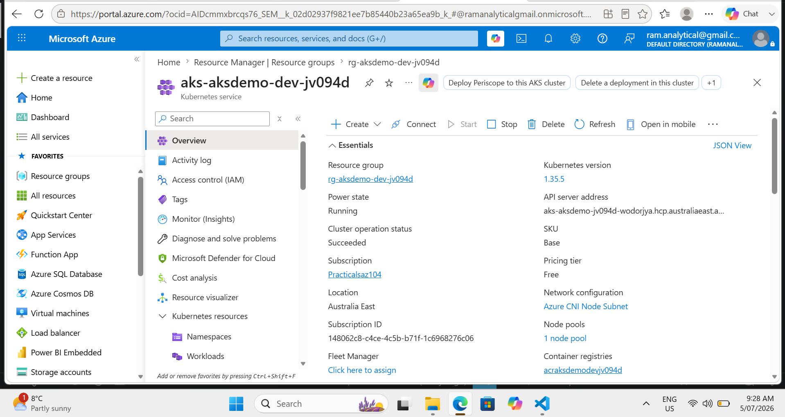
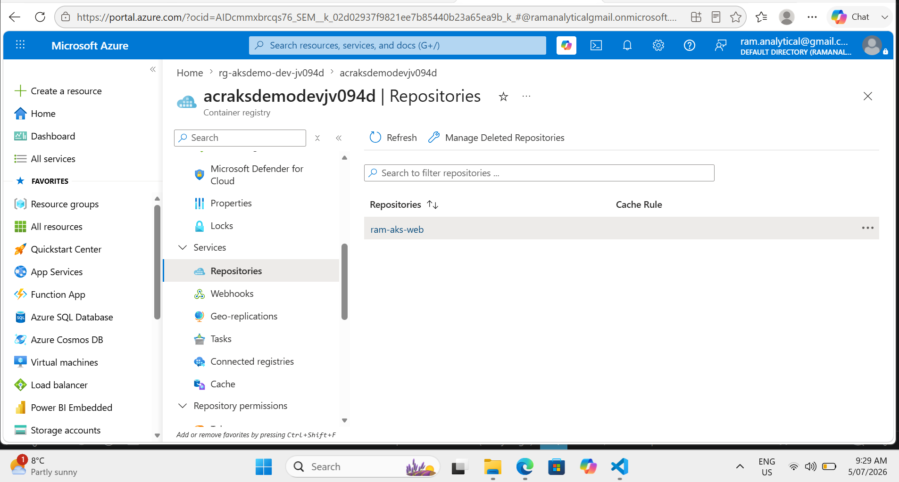
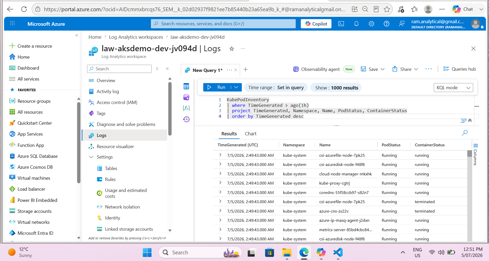

# Azure AKS Container Platform with Terraform, GitHub Actions and Monitoring

## Project Overview

Designed and implemented a containerised application platform on Azure using **AKS, ACR, Terraform, GitHub Actions, Azure Monitor, Log Analytics, Container Insights, and alerting**.

The project demonstrates Infrastructure as Code, secure CI/CD automation, Kubernetes workload deployment, monitoring, and operational alerting.

---

## Architecture


---

## Solution Flow

```text
Developer
→ GitHub Repository
→ GitHub Actions
→ Docker Build
→ Azure Container Registry
→ AKS Cluster
→ Kubernetes Service LoadBalancer
→ Browser
```

Monitoring flow:

```text
AKS Cluster
→ Container Insights
→ Log Analytics Workspace
→ Alert Rules
→ Action Group
→ Email Notification
```

---

## Technologies Used

| Area | Tools |
|---|---|
| Cloud | Azure |
| Infrastructure as Code | Terraform |
| Containers | Docker, AKS, ACR |
| CI/CD | GitHub Actions |
| Authentication | OIDC |
| Kubernetes | Deployment, Pods, Service LoadBalancer |
| Monitoring | Azure Monitor, Container Insights |
| Logging | Log Analytics Workspace |
| Alerting | Azure Monitor Alerts, Action Group |

---

## Terraform Modules

```text
modules/
├── resource_group/
├── network/
├── acr/
├── aks/
├── monitoring/
└── alerts/
```

Terraform provisions:

```text
Resource Group
VNet/Subnet
Azure Container Registry
AKS Cluster
Log Analytics Workspace
Container Insights
Alert Rules
Action Group
```

---

## CI/CD Pipeline

GitHub Actions workflow:

```text
1. Login to Azure using OIDC
2. Build Docker image
3. Push image to ACR
4. Get AKS credentials
5. Apply Kubernetes manifest
6. Validate rollout
```

Workflow file:

```text
.github/workflows/deploy-aks.yml
```

---

## Monitoring and Alerts

Monitoring is enabled using **Azure Monitor, Container Insights, and Log Analytics**.

Configured alerts:

```text
Node Not Ready
Pod Failed / CrashLoopBackOff
Pod Restarts
```

---

## Validation Commands

```bash
kubectl get nodes
kubectl get pods
kubectl get svc
kubectl get deployment
kubectl rollout status deployment/ram-webapp
```

ACR validation:

```bash
az acr repository list --name <acr-name> --output table
az acr repository show-tags --name <acr-name> --repository ram-aks-web --output table
```

Log Analytics query:

```kql
KubePodInventory
| where TimeGenerated > ago(1h)
| project TimeGenerated, Namespace, Name, PodStatus, ContainerStatus
| order by TimeGenerated desc
```

---

## Screenshots

### GitHub Actions Success


### Azure Resource Group


### AKS Cluster Overview



### ACR Image Repository



### Kubernetes Pods and Service


### Application Running


### Container Insights


### Log Analytics Query



### Alert Rules


---

## Key Outcomes

This project demonstrates:

```text
Scalable containerised application deployment on AKS
Secure CI/CD using GitHub Actions and OIDC
Infrastructure provisioning using modular Terraform
Container image management using ACR
Operational monitoring using Azure Monitor and Log Analytics
Proactive alerting for AKS workload health
```

---

## Cleanup

To avoid ongoing Azure cost:

```bash
terraform destroy
```

---

## Future Enhancements

```text
Helm chart for application deployment
Prometheus and Grafana dashboards
ArgoCD for GitOps deployment
Azure Key Vault for secrets
Terraform remote backend using Azure Storage Account
Ingress Controller and TLS
```