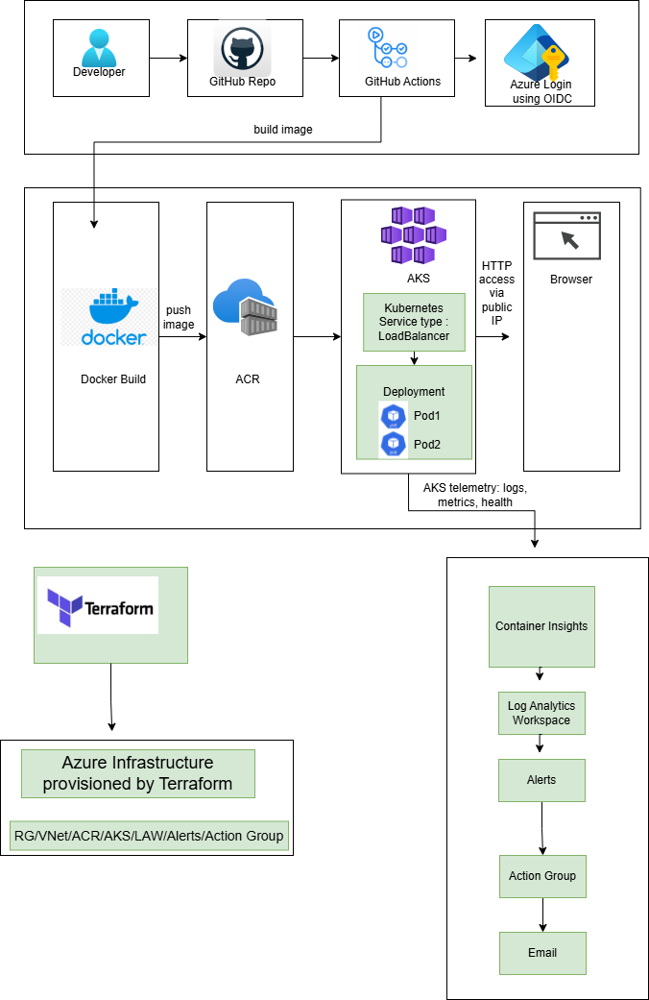
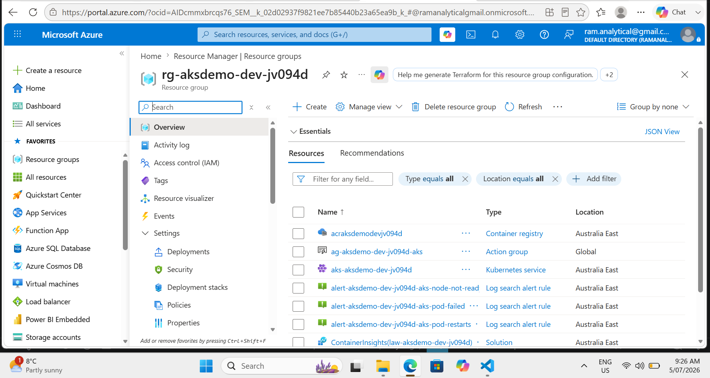
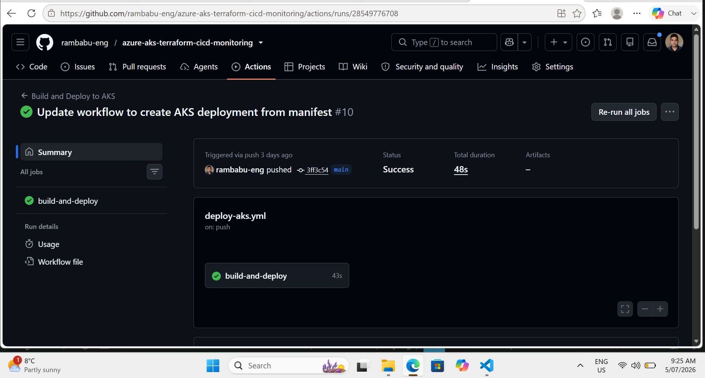
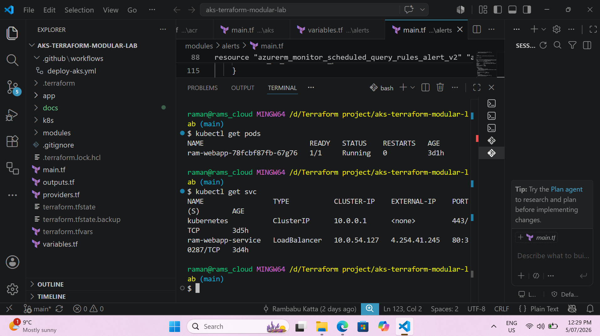
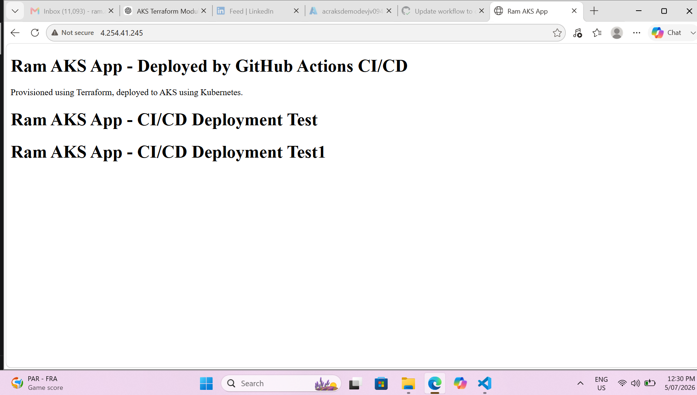
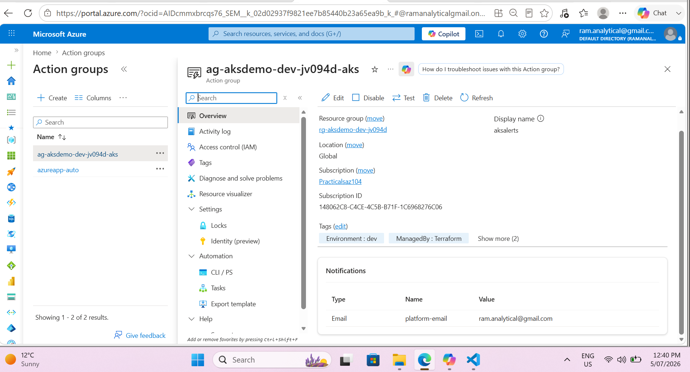
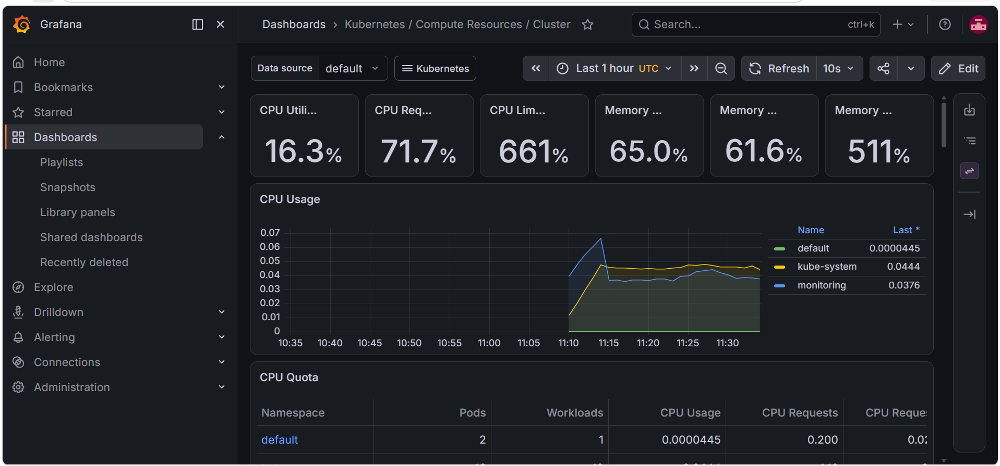

# Azure AKS Container Platform

A modular Azure Kubernetes Service platform built using Terraform, Docker, Azure Container Registry, GitHub Actions, Helm, Argo CD, Azure Monitor, Prometheus, and Grafana.

This project demonstrates an end-to-end container platform covering infrastructure provisioning, secure CI authentication, container image delivery, Kubernetes application packaging, GitOps deployment, monitoring, alerting, and observability.

## Business Problem

Application teams need a reliable and repeatable platform for deploying containerised workloads.

Manual infrastructure provisioning and direct Kubernetes deployments can introduce:

* Configuration inconsistencies
* Stored cloud credentials
* Deployment drift
* Limited monitoring visibility
* Difficult release and rollback processes
* Unclear separation between CI and deployment responsibilities

## Solution

This project implements an Azure AKS platform that provides:

* Repeatable infrastructure using modular Terraform
* Passwordless GitHub Actions authentication using OIDC
* Automated Docker image build and delivery to Azure Container Registry
* Kubernetes application packaging using Helm
* GitOps deployment and drift reconciliation using Argo CD
* Azure-native monitoring using Container Insights and Log Analytics
* Proactive alerting using Azure Monitor Alerts and Action Groups
* Kubernetes-native observability using Prometheus and Grafana

## Architecture



### Application Delivery Flow

```text
Developer
   ↓
GitHub Repository
   ↓
GitHub Actions
   ↓
Docker Image Build
   ↓
Azure Container Registry
   ↓
Argo CD
   ↓
Helm Chart
   ↓
Azure Kubernetes Service
   ↓
LoadBalancer Service
   ↓
Application
```

### Monitoring Flow

```text
Azure Kubernetes Service
├── Container Insights
│      ↓
│   Log Analytics
│      ↓
│   Azure Monitor Alerts
│      ↓
│   Action Group
│
└── Prometheus
       ↓
    Grafana Dashboards
```

## Platform Implementation Phases

The platform was implemented progressively across the following phases:

| Phase   | Platform Layer           | Main Capabilities                                               |
| ------- | ------------------------ | --------------------------------------------------------------- |
| Phase 1 | Azure Infrastructure     | Terraform modules, networking, ACR, AKS and Log Analytics       |
| Phase 2 | Application Deployment   | Docker container, Kubernetes Deployment, Pods and Service       |
| Phase 3 | Continuous Integration   | GitHub Actions, Azure OIDC, image build and ACR delivery        |
| Phase 4 | Application Packaging    | Helm chart, templates, values, upgrades and rollback            |
| Phase 5 | Azure Monitoring         | Container Insights, Log Analytics, KQL, alerts and Action Group |
| Phase 6 | Kubernetes Observability | Prometheus metrics and Grafana dashboards                       |
| Phase 7 | GitOps Deployment        | Argo CD synchronisation, self-healing and drift reconciliation  |

## Phase Documentation

### Phase 1 — Azure Infrastructure Foundation

Provision the Azure resource group, virtual network, AKS subnet, Azure Container Registry, AKS cluster, Log Analytics Workspace, Container Insights and alerting resources using modular Terraform.

[Read Phase 1 — Azure Infrastructure Foundation](docs/phases/phase-01-infrastructure.md)

### Phase 2 — Containerised Application Deployment

Build the sample application as a Docker image and deploy it to AKS using a Kubernetes Deployment, Pods and a LoadBalancer Service.

[Read Phase 2 — Containerised Application Deployment](docs/phases/phase-02-application-deployment.md)

### Phase 3 — GitHub Actions and OIDC

Configure passwordless GitHub-to-Azure authentication, automatically build the Docker image, assign a commit-based image tag and push the image to Azure Container Registry.

[Read Phase 3 — GitHub Actions and OIDC](docs/phases/phase-03-github-actions.md)

### Phase 4 — Helm Application Packaging

Migrate the application from raw Kubernetes manifests to a reusable Helm chart containing configurable Deployment and Service templates.

[Read Phase 4 — Helm Application Packaging](docs/phases/phase-04-helm.md)

### Phase 5 — Azure Monitoring and Alerting

Enable Container Insights and Log Analytics, validate workload data using KQL, configure Azure Monitor alerts and send notifications through an Action Group.

[Read Phase 5 — Azure Monitoring and Alerting](docs/phases/phase-05-azure-monitoring.md)

### Phase 6 — Prometheus and Grafana

Deploy the `kube-prometheus-stack` Helm chart and validate cluster, node, namespace, pod and workload metrics using Grafana dashboards.

[Read Phase 6 — Prometheus and Grafana](docs/phases/phase-06-prometheus-grafana.md)

### Phase 7 — Argo CD GitOps

Configure Argo CD to monitor the Helm chart in GitHub, synchronise the desired state to AKS and automatically correct configuration drift.

[Read Phase 7 — Argo CD GitOps](docs/phases/phase-07-argocd-gitops.md)

### Platform Validation and Cleanup

Validate the complete platform using Terraform, Azure CLI, kubectl, Helm and Argo CD commands. This guide also contains failure testing and cleanup procedures.

[Read Platform Validation and Cleanup](docs/phases/validation-and-cleanup.md)

## Technology Stack

| Area                     | Technology                            |
| ------------------------ | ------------------------------------- |
| Cloud Platform           | Microsoft Azure                       |
| Infrastructure as Code   | Terraform                             |
| Container Platform       | Azure Kubernetes Service              |
| Container Registry       | Azure Container Registry              |
| Containerisation         | Docker                                |
| Continuous Integration   | GitHub Actions                        |
| Cloud Authentication     | OpenID Connect                        |
| Application Packaging    | Helm                                  |
| GitOps                   | Argo CD                               |
| Azure Monitoring         | Azure Monitor and Container Insights  |
| Logging                  | Log Analytics                         |
| Alerting                 | Azure Monitor Alerts and Action Group |
| Kubernetes Observability | Prometheus and Grafana                |

## Repository Structure

```text
.
├── .github/
│   └── workflows/
│       └── deploy-aks.yml
├── app/
├── helm/
│   └── ram-webapp/
│       ├── Chart.yaml
│       ├── values.yaml
│       └── templates/
│           ├── deployment.yaml
│           └── service.yaml
├── modules/
│   ├── resource_group/
│   ├── network/
│   ├── acr/
│   ├── aks/
│   ├── monitoring/
│   └── alerts/
├── docs/
│   ├── architecture/
│   │   └── architecture-diagram.png
│   ├── screenshots/
│   └── phases/
│       ├── phase-01-infrastructure.md
│       ├── phase-02-application-deployment.md
│       ├── phase-03-github-actions.md
│       ├── phase-04-helm.md
│       ├── phase-05-azure-monitoring.md
│       ├── phase-06-prometheus-grafana.md
│       ├── phase-07-argocd-gitops.md
│       └── validation-and-cleanup.md
└── README.md
```

Adjust this repository tree if the actual Terraform root files are stored in an additional folder.

## Key Platform Responsibilities

### Terraform

Terraform provisions and manages the Azure infrastructure.

```text
Terraform
   ↓
Azure Resource Group
   ↓
Networking
   ↓
Azure Container Registry
   ↓
Azure Kubernetes Service
   ↓
Monitoring and Alerting
```

### GitHub Actions

GitHub Actions performs continuous integration.

```text
Source Code Change
   ↓
GitHub Actions
   ↓
Azure Login Using OIDC
   ↓
Docker Image Build
   ↓
Image Push to ACR
```

### Argo CD

Argo CD owns Kubernetes application deployment.

```text
Helm Configuration in Git
   ↓
Argo CD
   ↓
Desired-State Comparison
   ↓
AKS Deployment
   ↓
Drift Reconciliation
```

This separation ensures that GitHub Actions does not directly own the Kubernetes application deployment.

## Project Evidence

### Azure Infrastructure



### GitHub Actions



### Kubernetes Application



### Application Availability



### Azure Monitor Alerts



### Grafana Dashboard



### Argo CD GitOps


## Key Outcomes

* Provisioned repeatable Azure infrastructure using modular Terraform.
* Deployed and validated containerised workloads on Azure Kubernetes Service.
* Implemented passwordless GitHub Actions authentication using OIDC.
* Automated Docker image build and delivery to Azure Container Registry.
* Migrated application configuration from raw Kubernetes YAML to Helm.
* Implemented Argo CD as the Kubernetes deployment owner.
* Separated continuous integration from GitOps deployment.
* Validated Git-driven deployment and configuration reconciliation.
* Enabled Azure-native monitoring using Container Insights and Log Analytics.
* Added proactive Azure Monitor alerting and Action Group notifications.
* Deployed Prometheus and Grafana for Kubernetes-native observability.

## Future Improvements

* Terraform remote backend using Azure Storage
* Azure Key Vault integration
* Microsoft Entra Workload Identity
* Private AKS cluster
* Private connectivity to Azure Container Registry
* Azure Policy for AKS governance
* Ingress controller with TLS
* Horizontal Pod Autoscaler
* Kubernetes network policies
* Separate development and production environments
